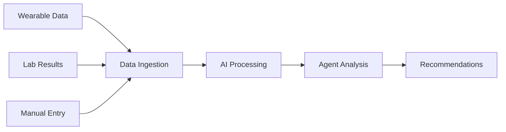

# Elyx Platform 🚀

[](https://opensource.org/licenses/MIT)
[](https://www.python.org/downloads/)
[](https://nextjs.org/)
[](https://fastapi.tiangolo.com/)

> **Advanced AI-Powered Health Intervention Platform** with multi-agent orchestration, decision traceability, and longitudinal health journey management.

## 🌟 Overview

Elyx Platform is a sophisticated health intervention system that demonstrates cutting-edge AI orchestration, decision provenance tracking, and comprehensive health journey visualization. Built for the modern healthcare ecosystem, it provides intelligent agent-based interactions with full traceability and evidence-based decision making.

### ✨ Key Features

- **🤖 Multi-Agent AI System** - 6 specialized AI agents with distinct roles and SLA tracking
- **📊 Decision Traceability** - Full "why" provenance for every AI decision and recommendation
- **🎯 Episode Management** - Structured health episodes with triggers, interventions, and outcomes
- **🔬 Experiment Engine** - Hypothesis-driven health interventions with measurement tracking
- **📈 Real-time Analytics** - Health metrics visualization and trend analysis
- **🔄 Issue Resolution** - Intelligent problem detection and resolution tracking
- **👤 User Profiling** - Context-aware personalized health insights

## 🏗️ Architecture

```
┌─────────────────┐    ┌─────────────────┐    ┌─────────────────┐
│   Frontend      │    │    Backend      │    │   AI Agents     │
│   (Next.js)     │◄──►│   (FastAPI)     │◄──►│   (CrewAI)      │
│                 │    │                 │    │                 │
│ • Modern UI     │    │ • REST API      │    │ • Ruby          │
│ • Real-time     │    │ • SQLite DB     │    │ • Dr. Warren    │
│ • Responsive    │    │ • LLM Router    │    │ • Advik         │
└─────────────────┘    └─────────────────┘    │ • Carla         │
                                              │ • Rachel        │
                                              │ • Neel          │
                                              └─────────────────┘
```

## 🚀 Quick Start

### Prerequisites

- **Python 3.8+**
- **Node.js 18+**
- **Git**

### Installation

1. **Clone the repository**
   ```bash
   git clone https://github.com/shrreku/elyx_platform.git
   cd elyx_platform
   ```

2. **Backend Setup**
   ```bash
   # Create virtual environment
   python -m venv .venv
   source .venv/bin/activate  # On Windows: .venv\Scripts\activate
   
   # Install dependencies
   pip install -r requirements.txt
   
   # Set up environment variables
   cp .env.example .env
   # Edit .env with your API keys
   ```

3. **Frontend Setup**
   ```bash
   cd frontend
   npm install
   ```

4. **Start the Platform**
   ```bash
   # Terminal 1: Start Backend
   python -m uvicorn backend.main:app --host 0.0.0.0 --port 8787 --reload
   
   # Terminal 2: Start Frontend
   cd frontend
   npm run dev
   ```

5. **Access the Platform**
   - **Frontend**: http://localhost:3000
   - **Backend API**: http://localhost:8787
   - **API Docs**: http://localhost:8787/docs

## 🤖 AI Agents

### Agent Roles & Specializations

| Agent | Role | Responsibilities | SLA Target |
|-------|------|-----------------|------------|
| **Ruby** | Concierge & Logistics | Scheduling, coordination, friction removal | 1 hour |
| **Dr. Warren** | Medical Strategist | Clinical decisions, lab interpretation | 4 hours |
| **Advik** | Performance Scientist | Wearable data, exercise protocols | 3 hours |
| **Carla** | Nutrition Specialist | Meal planning, metabolic optimization | 2 hours |
| **Rachel** | Mental Health Coach | Stress management, behavioral insights | 3 hours |
| **Neel** | Integration Specialist | Data synthesis, system coordination | 2 hours |

### Agent Orchestration

```python
# Example: Message routing with urgency detection
{
  "message": "Chest pain since morning",
  "urgency": "critical",
  "assigned_agents": ["Dr. Warren", "Ruby"],
  "sla_deadline": "2024-01-15T10:30:00Z",
  "escalation_triggered": true
}
```

## 📊 Core Features

### 1. Episode Management
Track structured health episodes from trigger to resolution:

```json
{
  "episode_id": "ep_001",
  "user_id": "rohan",
  "title": "Sleep Quality Optimization",
  "status": "in_progress",
  "trigger_type": "wearable_alert",
  "interventions": [
    {
      "agent": "Advik",
      "action": "sleep_protocol_adjustment",
      "timestamp": "2024-01-15T09:00:00Z"
    }
  ],
  "outcome_metrics": {
    "sleep_score": 85,
    "hrv_improvement": 12
  }
}
```

### 2. Decision Traceability
Every AI decision includes full provenance:

```json
{
  "decision_id": "dec_001",
  "agent": "Dr. Warren",
  "decision": "Recommend vitamin D supplementation",
  "evidence": [
    "Lab result: 25(OH)D = 18 ng/mL",
    "Symptom correlation: fatigue, mood",
    "Literature: Vitamin D deficiency prevalence"
  ],
  "confidence": 0.92,
  "alternatives_considered": ["Light therapy", "Dietary changes"]
}
```

### 3. Experiment Engine
Hypothesis-driven health interventions:

```json
{
  "experiment_id": "exp_001",
  "hypothesis": "Intermittent fasting will improve metabolic markers",
  "protocol": {
    "duration": "8 weeks",
    "intervention": "16:8 intermittent fasting",
    "measurements": ["glucose", "insulin", "weight"]
  },
  "results": {
    "primary_outcome": "glucose_reduction",
    "effect_size": 0.8,
    "statistical_significance": 0.03
  }
}
```

## 🛠️ API Reference

### Core Endpoints

| Endpoint | Method | Description |
|----------|--------|-------------|
| `/chat` | POST | Send message to AI agents |
| `/suggestions` | GET/POST | Manage AI suggestions |
| `/issues` | GET/POST | Track health issues |
| `/episodes` | GET/POST | Manage health episodes |
| `/experiments` | GET/POST | Run health experiments |
| `/decisions` | GET | View decision history |
| `/profiles/{user_id}` | GET/POST | User profile management |

### Example API Usage

```bash
# Send a message to agents
curl -X POST "http://localhost:8787/chat" \
  -H "Content-Type: application/json" \
  -d '{
    "sender": "Rohan",
    "message": "I have been feeling tired lately",
    "use_crewai": false
  }'

# Get user issues
curl "http://localhost:8787/issues"

# Create experiment
curl -X POST "http://localhost:8787/experiments" \
  -H "Content-Type: application/json" \
  -d '{
    "title": "Sleep Optimization",
    "hypothesis": "Blue light blocking improves sleep quality",
    "duration": 30
  }'
```

## 🎨 Frontend Features

### Modern UI Components
- **Sticky Header** with pill-style navigation
- **Real-time Chat** with agent identification
- **Status Filters** for suggestions and episodes
- **Interactive Charts** for health metrics
- **Responsive Design** for all devices

### Key Pages
- **Dashboard** - Overview of health status and metrics
- **Chat** - Interact with AI agents
- **Suggestions** - View and manage AI recommendations
- **Episodes** - Track health intervention episodes
- **Experiments** - Monitor ongoing health experiments
- **Data Management** - Import/export health data

## 📁 Project Structure

```
elyx_platform/
├── agents/                 # AI Agent System
│   ├── elyx_agents.py     # Agent definitions & orchestration
│   ├── issue_extractor.py # Issue detection from messages
│   ├── plan_extractor.py  # Suggestion extraction
│   └── experiment_engine.py # Experiment management
├── backend/               # FastAPI Backend
│   └── main.py           # API endpoints & business logic
├── data/                 # Data Layer
│   ├── db.py            # SQLite database operations
│   ├── models.py        # Pydantic data models
│   └── persistence.py   # Data persistence utilities
├── frontend/             # Next.js Frontend
│   └── src/app/         # React components & pages
├── demo/                # Demo scripts & mock data
├── monitoring/          # Observability & logging
├── simulation/          # Journey simulation tools
└── tests/              # Test suites
```

## 🔧 Configuration

### Environment Variables

Create a `.env` file in the project root:

```env
# AI/LLM Configuration
OPENAI_API_KEY=your_openai_key_here
OPENROUTER_API_KEY=your_openrouter_key_here
OPENAI_MODEL_NAME=gpt-4-turbo-preview

# Database
ELYX_DB_PATH=data/elyx.db

# Monitoring (Optional)
LANGFUSE_SECRET_KEY=your_langfuse_key
LANGFUSE_PUBLIC_KEY=your_langfuse_public_key
LANGFUSE_HOST=https://cloud.langfuse.com
```

## 📈 Health Data Integration

### Supported Data Sources
- **Wearables**: Apple Health, Fitbit, Oura, Whoop
- **Lab Results**: Direct upload or API integration
- **Manual Entry**: Symptoms, medications, lifestyle factors
- **Continuous Monitoring**: CGM, BP monitors, smart scales

### Data Pipeline


## 🧪 Testing

```bash
# Run backend tests
pytest tests/

# Run frontend tests
cd frontend
npm test

# Integration tests
python -m pytest tests/test_integration.py
```

## 📊 Monitoring & Analytics

### Built-in Analytics
- **Agent Performance**: Response times, accuracy metrics
- **User Engagement**: Message frequency, feature usage
- **Health Outcomes**: Episode resolution rates, experiment success
- **System Health**: API latency, error rates

### Observability Stack
- **Logging**: Structured JSON logs with correlation IDs
- **Metrics**: Prometheus-compatible metrics endpoint
- **Tracing**: Full request tracing through agent interactions
- **Alerting**: SLA violation alerts and system health monitoring

## 🚀 Deployment

### Docker Deployment (Recommended)

```bash
# Build and run with Docker Compose
docker-compose up -d

# Scale services
docker-compose up --scale backend=3
```

### Manual Deployment

```bash
# Production backend
gunicorn backend.main:app -w 4 -k uvicorn.workers.UvicornWorker

# Production frontend
cd frontend
npm run build
npm start
```

## 🤝 Contributing

We welcome contributions! Please see our [Contributing Guidelines](CONTRIBUTING.md) for details.

### Development Workflow
1. Fork the repository
2. Create a feature branch (`git checkout -b feature/amazing-feature`)
3. Commit your changes (`git commit -m 'Add amazing feature'`)
4. Push to the branch (`git push origin feature/amazing-feature`)
5. Open a Pull Request

## 📜 License

This project is licensed under the MIT License - see the [LICENSE](LICENSE) file for details.

## 🙏 Acknowledgments

- **CrewAI** for multi-agent orchestration framework
- **FastAPI** for high-performance API framework
- **Next.js** for modern React development
- **OpenAI** for language model capabilities

## 📞 Support

- **Documentation**: [Full Documentation](https://github.com/shrreku/elyx_platform/wiki)
- **Issues**: [GitHub Issues](https://github.com/shrreku/elyx_platform/issues)
- **Discussions**: [GitHub Discussions](https://github.com/shrreku/elyx_platform/discussions)

---

<div align="center">
  <strong>Built with ❤️ for the future of personalized healthcare</strong>
</div>